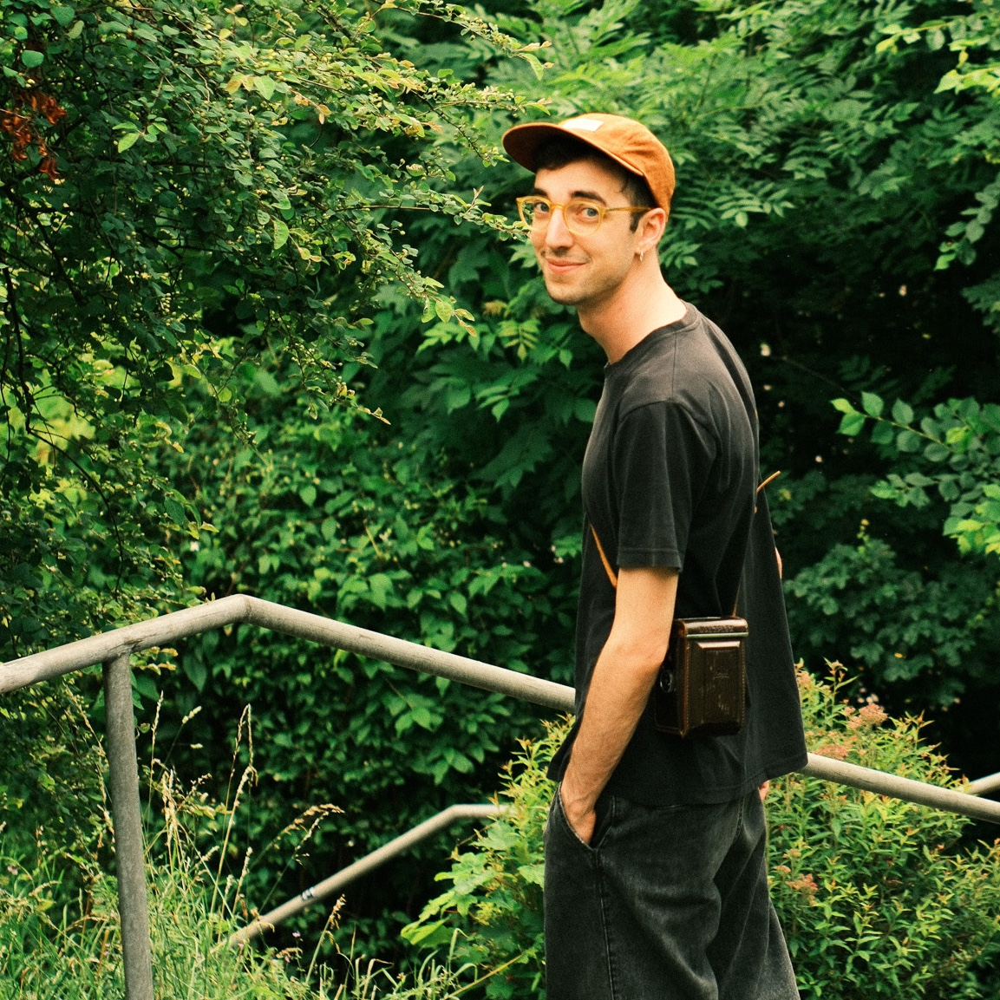

# About

Hi! My name is **Lauro Silini**.

I am currently a postdoc researcher at the Institute of Science and Technology Austria [ISTA](https://ist.ac.at/en/home/) in the group of [Prof. Julian Fischer](https://ist.ac.at/en/research/fischer-group/) and [Prof. Jan Maas](https://ist.ac.at/en/research/maas-group/).

I'm interested in Geometric Analysis, Riemannian Geometry, Optimal Transport, and Fluid dynamics.

I completed my PhD at [ETH](https://ethz.ch/en.html) under the supervision of [Alessio Figalli](https://people.math.ethz.ch/~afigalli/) and [Urs Lang](https://people.math.ethz.ch/~lang/).

I did my Master at [ETH](https://ethz.ch/en.html) in 2020, and before that I did my Bachelor at [EPFL](https://www.epfl.ch/fr/).

