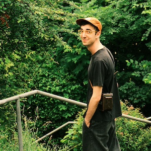

# About

Hi! My name is **Lauro Silini**.

On September 1st 2024 I will start a fellowship at [ISTA](https://mathematics.pages.ist.ac.at/) in Austria.

I'm interested in Geometric Analysis, Riemannian Geometry, Optimal Transport and Fluid dynamics.

I completed my PhD at [ETH](https://ethz.ch/en.html) under the supervision of [Alessio Figalli](https://people.math.ethz.ch/~afigalli/) and [Urs Lang](https://people.math.ethz.ch/~lang/).

I did my Master at [ETH](https://ethz.ch/en.html) in 2020, and before that I did my Bachelor at [EPFL](https://www.epfl.ch/fr/).

